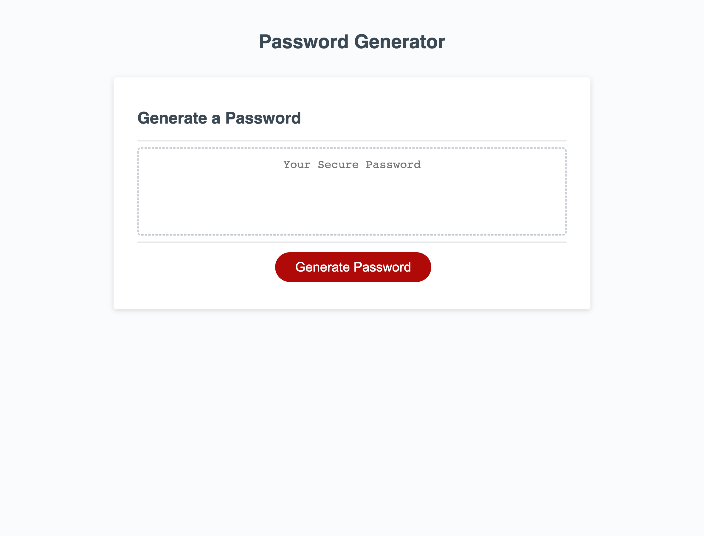

# generate-password
Repository for code that generates a random user password. 

## Description

Web application users can use to generate a random password. 

## Usage

To use this project, you can review the html, css, and JavaScript files. To test your own suggestions on what to adjust, open the Chrome DevTools by pressing Command+Option+I (macOS) or Control+Shift+I (Windows). Try any changes in the console panel and see then update in real time. 

Link to the [deployed application](https://amandajduva.github.io/generate-password/). 

Screenshot of deployed application:

## Credits

I received starter code for this application from this [GitHub repository](https://github.com/coding-boot-camp/friendly-parakeet.git). I received support from a tutor to check my function and to debug my for loop.  

## License

Please refer to the LICENSE in the repo.